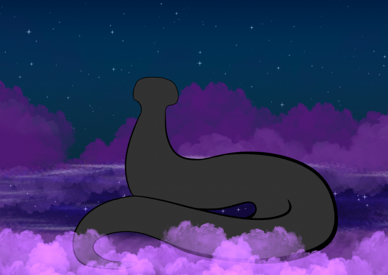
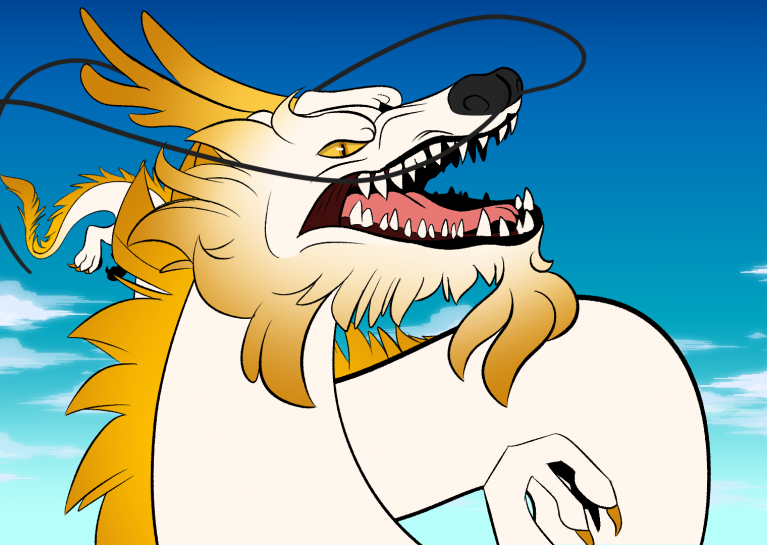
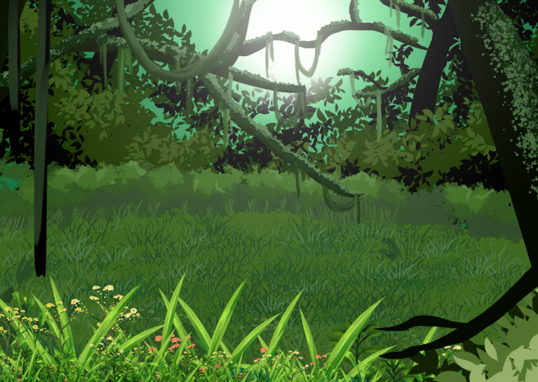
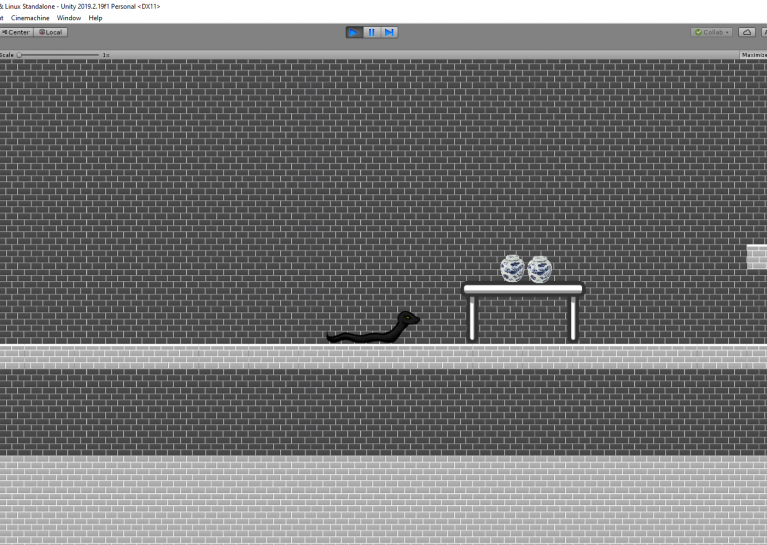
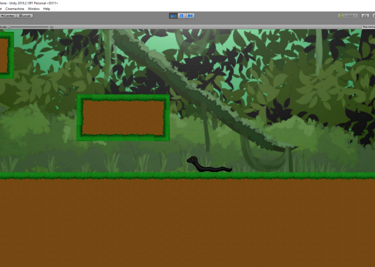

# Road-To-Repair-The-Longwei
Our game for Global Game Jam 2020

Artistic journey as a snake in order to repair yourself and three towers.
## Jam Site: 
LSU Global Game Jam
## Jam Year: 
2020
## Platforms: 
MS Windows
## Tools And Technologies: 
Unity (any product)
## Technology Notes: 
Audacity, GarageBand, Clip Studio Paint EX, PhotoShop
## Credits: 
- Jackson Oberkirch - Programming
- Vanessa Hoffmann - Programming 
- Elizabeth Alvarado - Programming/Art 
- Carmen Salvaggio - Art
- Kenneth Gornor- Audio/ Composition
- Kevin Hall - Audio / Sound Effects 

## Video Link: 
https://drive.google.com/open?id=1SgzRDoaA3f-0GdH2rLpmS0x9pauSrBcs

## Game Stills: 

